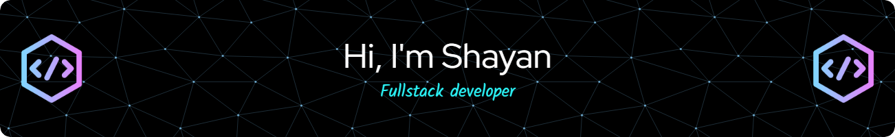

### 👋 Hi, I'm Shayan

I'm a **Fullstack Software Developer** with a strong foundation in C++, Python, JavaScript, and modern frameworks like React and .NET. I’m passionate about building efficient, scalable solutions—from backend systems to interactive user interfaces.

#### 🛠️ Tech Stack & Tools:
- **Languages:** C++, Python, JavaScript, C#, HTML/CSS, Dockerfile  
- **Frameworks & Libraries:** React, Tailwind, .NET, Flask, TensorFlow  
- **Tools:** Git, Docker, Postman, VS Code, GitHub Actions  

#### 🔭 What I’m Working On:
- Cyber resiliency tools for real-time risk assessment  
- Custom memory manager for low-level system operations  
- AI-assisted utilities using TensorFlow and OpenTelemetry  

#### 🎓 Education:
- **B.S. in Computer Science**, University of Florida

I'm always open to collaboration on innovative projects, especially those involving AI, cybersecurity, and system-level programming.  
Feel free to explore my work and connect with me!

<h3 align="left">Connect with me:</h3>

<h3 align="left">Languages and Tools:</h3>

           

  
  

